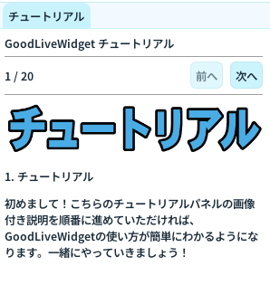

# インストール

## 動作環境

| 項目 | 要件                     |
| ---- | ------------------------ |
| OS   | Windows 10 / 11（64bit） |
| RAM  | 8GB 以上推奨             |

配信連携（YouTube / Twitch）を使う場合は、[配信パネル](panels/connection.md) を参照してください。

---

## ダウンロード

[Booth ページ（GoodLuckLab Shop）](https://goodlucklabshop.booth.pm/) から ZIP をダウンロードしてください。

---

## セットアップ手順

### 1. ZIP を展開する

任意のフォルダに ZIP を展開します。  
**ポータブル配布** のため、インストーラーは不要です。

展開後の構成（概要）:

```
GoodLiveWidget/
├── GoodLiveWidget.exe
├── bootstrap.exe          … CEF サブプロセス
├── libcef.dll など         … CEF ランタイム（exe 隣必須）
├── userdata/               … 設定・プロファイル（更新時に温存）
│   ├── config/
│   └── profiles/
└── data/                   … HTML・翻訳・フォント等（更新時に上書き可）
    ├── html/
    ├── translations/
    └── ...
```

!!! info "userdata を温存する"
設定・プロファイル・DB は `userdata/` に保存されます。  
 アップデート時は **exe と data/ のみ上書き** し、`userdata/` は残してください。

### 2. 起動する

`GoodLiveWidget.exe` をダブルクリックして起動します。

起動後はソフト内のチュートリアルパネルを参照してください。
こちらを順番に進めることで、OBS へのオーバーレイ表示や、ウィジェットの使い方を非常に簡単に使い方をマスターできます。



---

## OBS 側の準備

1. OBS Studio をインストール
2. （推奨）OBS WebSocket サーバーを有効化
   - OBS 31 以降: 標準で組み込み（既定ポート **4455**）
   - ソース自動更新などに使用します
3. ブラウザソースを追加
   - URL は [接続パネル](panels/connection.md) で確認（例: `http://127.0.0.1:21760/1`）

---

## アップデート

1. Booth から新しい ZIP をダウンロード
2. 展開した **exe・CEF 関連 DLL・data/** を既存フォルダへ上書き
3. **`userdata/` は上書きしない**

---

## アンインストール

レジストリは使用していません。展開したフォルダごと削除してください。  
ユーザーデータは `userdata/` 内にあります。
