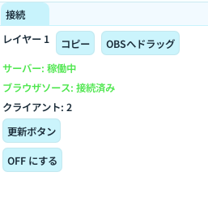

# 接続パネル

接続パネルは、GoodLiveWidget と OBS ブラウザソースをつなぐための管理画面です。

## できること

- レイヤーごとの配信URLをコピーできる
- OBS へ直接ドラッグしてブラウザソースを追加できる
- 接続状態（サーバー/ブラウザソース/クライアント数）を確認できる
- 「更新ボタン」で OBS 側のブラウザソース更新を再送できる

## 基本操作

1. 使用したいレイヤーの「OBSへドラッグ」で OBS のソース一覧へ直接追加する、もしくは「コピー」でURLを取得する
2. 状態表示が「サーバー: 稼働中」「ブラウザソース: 接続済み」になっているか確認する

## 画面の見方

- 「レイヤー n」: そのレイヤー専用の配信URLを操作する行
- 「サーバー: 稼働中/停止」: GoodLiveWidget 側の配信サーバー状態
- 「ブラウザソース: 接続済み/接続待ち」: OBS 側との接続状態
- 「クライアント: n」: 接続中のブラウザソース数

## 運用のコツ

- レイヤー数を増やしたときは、必要なレイヤーだけ OBS に追加する
- OBS 側の表示が更新されない場合は「更新ボタン」を押す
- 配信中に接続を切りたいときは「OFF にする」で一時停止できる

## よくあるつまずき

- OBS へドラッグできない: OBS が管理者権限で起動していないか確認する
- 接続待ちのまま: URL貼り付け先がブラウザソースになっているか確認する
- 反映が遅い: Settings パネルの OBS WebSocket ポート設定を見直す

## 関連ページ

- [Settings パネル](settings.md)
- [Preview パネル](preview.md)
- [パネル一覧](overview.md)
