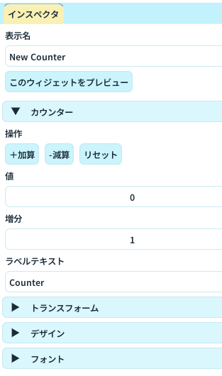

# インスペクタパネル

インスペクタパネルは、選択したウィジェットの内容を細かく編集するためのパネルです。

## できること

- 表示名の変更
- ウィジェット固有機能の調整（例: カウンター、コメント表示、トリガー条件）
- トランスフォーム（位置・サイズ・回転）の数値編集
- デザイン、フォント、色、枠線など見た目の調整

## 基本操作

1. [ウィジェット一覧パネル](widget-list.md)で編集したいウィジェットを選択する
2. インスペクタで「表示名」を必要に応じて変更する
3. 「トランスフォーム」で位置とサイズを調整する
4. 「デザイン」「フォント」など必要なセクションを編集する
5. [プレビューパネル](preview.md)で表示崩れがないか確認する

## セクションの見方

- セクション名はウィジェット種類によって変わる
- 同じウィジェットでも、機能追加により表示項目が増える場合がある
- 値を変更したら、すぐにプレビューへ反映される

## 運用のコツ

- 先に大きなレイアウトを [トランスフォームパネル](transform.md) で決めてから、インスペクタで細部を詰める
- 見た目を揃えたい場合は先に [共通デザインパネル](common-design.md) で決めておく

## 関連ページ

- [ウィジェット一覧パネル](widget-list.md)
- [トランスフォームパネル](transform.md)
- [プレビューパネル](preview.md)
