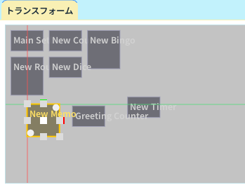

# トランスフォームパネル

トランスフォームパネルは、選択中レイヤーのウィジェットをキャンバス上で直接動かすための画面です。

## できること

- ドラッグで移動
- ハンドルでリサイズ
- 回転ハンドルで角度調整
- スナップガイドを使った整列
- ズームして細部調整

## 基本操作

1. [ウィジェット一覧パネル](widget-list.md)で対象レイヤーを選ぶ
2. キャンバス上のウィジェットをクリックして選択する
3. 黄色枠内をドラッグして移動する
4. 辺や角のハンドルでサイズを変更する
5. 回転ハンドルで角度を調整する

## ショートカット

- Shift: スナップガイドを有効化
- Ctrl: リサイズ時の縦横比を維持
- Alt + マウスホイール: キャンバスをズーム

## 調整のコツ

- まず大まかに配置し、最後に Shift で位置合わせすると早い
- 画面端に寄せるときは、スナップ表示を目安にする
- 密集したレイアウトはズームしてから調整するとミスが減る

## よくあるつまずき

- 別ウィジェットが動く: 先にクリックで選択を確認する
- 位置合わせが合わない: Shift を押しながら移動する
- 操作しづらい: Alt + ホイールでズームしてから調整する

## 関連ページ

- [インスペクタパネル](inspector.md)
- [プレビューパネル](preview.md)
- [ウィジェット一覧パネル](widget-list.md)
