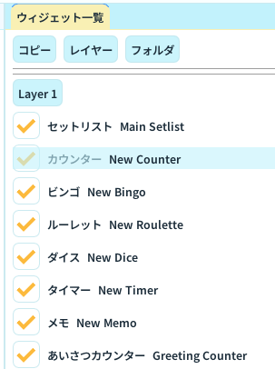

# ウィジェット一覧パネル

ウィジェット一覧パネルは、配信画面を組み立てるためのパネルです。

## できること

- ウィジェット追加
- ウィジェット複製
- レイヤー追加と切り替え
- フォルダ追加、名前変更、削除
- ウィジェットとフォルダのドラッグ移動
- 表示ON/OFF切り替え

## 基本操作

1. 追加先レイヤーを選ぶ
2. 右クリックメニューまたは追加メニューからウィジェットを追加する
3. 必要に応じてフォルダを作成して整理する
4. 行をドラッグして順序や所属フォルダを調整する
5. 編集対象をクリックし、インスペクタで詳細を調整する

## フォルダ運用

- フォルダは階層化できる
- フォルダを削除すると、中身は親階層へ移動する
- F2 または右クリックで名前変更できる

## レイヤー運用

- レイヤーごとに表示内容を分けられる
- レイヤー選択は Transform/Preview の編集対象にも影響する

## 運用のコツ

- 配信用途ごとにフォルダを分けると、運用ミスを減らせる
- レイヤーは「背景」「メイン情報」「エフェクト」など役割分担で設計すると管理しやすい
- 名前は配信中に見ても分かる短い名前にする

## 関連ページ

- [Inspector パネル](inspector.md)
- [Transform パネル](transform.md)
- [Common Design パネル](common-design.md)
